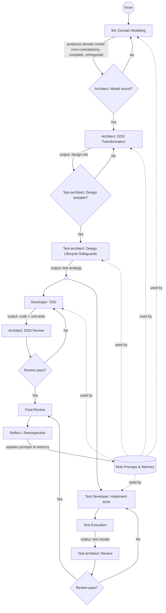

# Idea

Produce a full, executable spec for the `spec-to-code` workflow — superseding runs 00 and 01.

Requirements from the user:
- Every node has: role, inputs, outputs, artifact format (named sections), cycle/retry logic.
- Adversarial gates at every major handoff, not just BA→Architect.
- Parallel tracks after test-arch: developer (TDD) and test-developer run concurrently.
- Knowledge base (role prompts + memory) is consumed by all roles and updated by Reflect.
- Design is a trade-off outcome — the spec must state what is imperfect and why it was chosen anyway.

## Workflow graph (user-provided)

